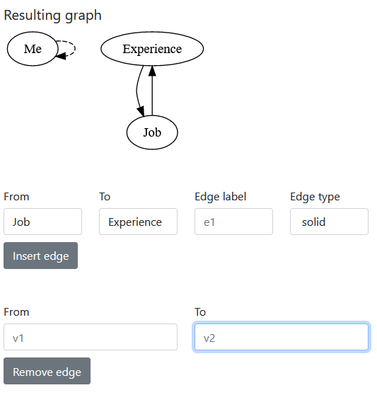

# Interactive graph editor
## Online version
- ### [Try here!](https://br4ch1st0chr0n3.github.io/elm-graph-editor/)

## Interface demo
<div style="margin-top: 10px;">
    </img>
</div>


## Wanna learn about Elm?
- [Visit their site](https://elm-lang.org/)
- Check [examples](https://elm-lang.org/examples)!


## Hosting Elm site locally
1. [Install elm](https://guide.elm-lang.org/install/elm.html)
1. Install [elm-live](https://github.com/wking-io/elm-live). It will re-build `.elm` files on changes.
    ```sh
    npm install --global elm elm-live@next
    ```
1. Clone this repository.
    ```sh
    git clone https://github.com/br4ch1st0chr0n3/elm-graph-editor
    ```
1. Go to the project's root folder.
    ```sh
    cd elm-graph-editor
    ```
1. Start `elm-live`. IDK why it works only with `--o`, not `--open`.
    ```sh
    elm-live src/Main.elm --start-page=src/index.html --open -- --o=src/Main.js
    ```
1. After changes in `src/index.html`, reload the page in your browser.

## Hosting Elm site on GitHub
1. Make sure that your `main` Elm function is at `src/Main.elm`. This is needed for the command `elm make src/Main.elm --output src/Main.js` in `.github/workflows/main.yml` to work. You will add this `main.yml` on the next step.
1. Create a [new workflow](https://docs.github.com/en/actions/quickstart). Instead of `github-actions-demo.yml`, use the file `.github/workflows/main.yml` from this repo.
1. Then go to **Settings** -> **Pages** -> **Source** -> **Branch**: `gh-pages` -> Click **Save**.
1. Now, if you see *Your site is published at* **link**, click this link.